# IBM Recipe - Watson Assistant
  

Aprende a crear un asistente virtual para ordenar tacos!
# Pre-requisitos
•	Tener instalado [**Node.js**](https://nodejs.org/es/). 
•	Tener una cuenta de [**IBM Cloud**](https://cloud.ibm.com/login). 
•	Tener una cuenta en [**Github**](https://github.com). 
•	Clonar este Repositorio.  
# Cupones para Estudiantes y profesores
1.	Acceder al [**HUB para Software para uso académico**](https://onthehub.com/ibm/?utm_sourc=ibm-ai-productpage&utm_medium=onthehubproductpage&utm_campaign=IBM). Y navegar hasta la parte de abajo de la pagina  
2.	Buscar el WebStore del instituto/escuela al que perteneces. 
3.	En caso de no contar con WebStore, acceder al portal de [**IBM Academic Initiative**](https://my15.digitalexperience.ibm.com/b73a5759-c6a6-4033-ab6b-d9d4f9a6d65b/dxsites/151914d1-03d2-48fe-97d9-d21166848e65/home/), registrarse o iniciar sesión y seleccionar la opción de Students 
4.	Seleccionar Add to Cart para IBM Bluemix – 6 Month Trial. 
5.	Realizar el registro correspondiente utilizando la cuenta de correo académica 

# Cargar créditos en IBM Cloud
1.	Ingresamos a nuestro panel de control de IBM Cloud (console.bluemix.net)
2.	Una vez que tengamos el código nos vamos a Gestionar>Facturación y Uso>Facturación
3.	Buscamos “Códigos de características (Promocionales)”
# Creación del servicio
1. Entrar al portal de [**IBM Cloud**](https://cloud.ibm.com/)
2. Ir al catalogo

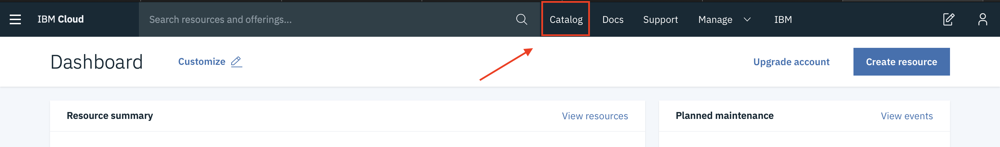  

3. Seleccionar la opción AI del menú lateral y dar clic en el servicio “WatsonAssistant”.

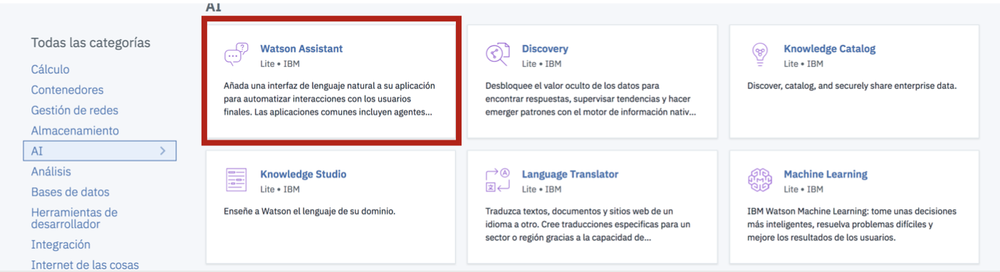  

4. Le damos un nombre al servicio y lo creamos

  

5. Del menú izquierdo, seleccionamos el apartado Manage y damos clic en "Launch Watson Assistant" para entrenar nuestro servicio.

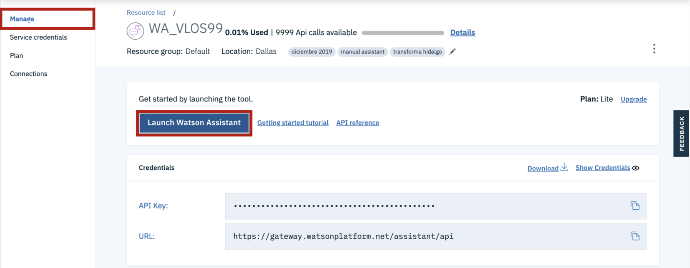  

6. Una vez que hayamos lanzado la herramienta veremos una landing page muy parecida a esta:

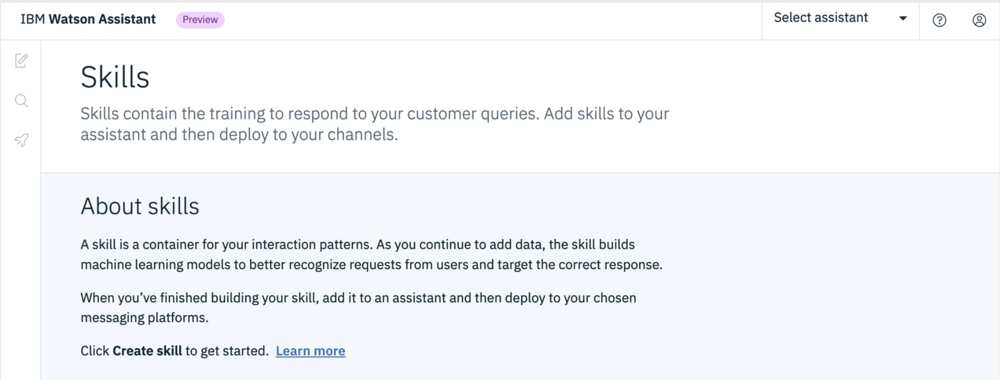  

# Creación del Assistant
1. En la parte superior derecha, damos clic en “Select Assistant” o “My first Assistant” y seleccionamos la opción “Create new assistant”.

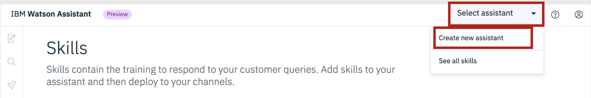  

2. A continuación, le damos un nombre a nuestro asistente, nos cercioramos de que esté habilitada la casilla de “Enable Preview Link” y damos clic en “Create assistant”.

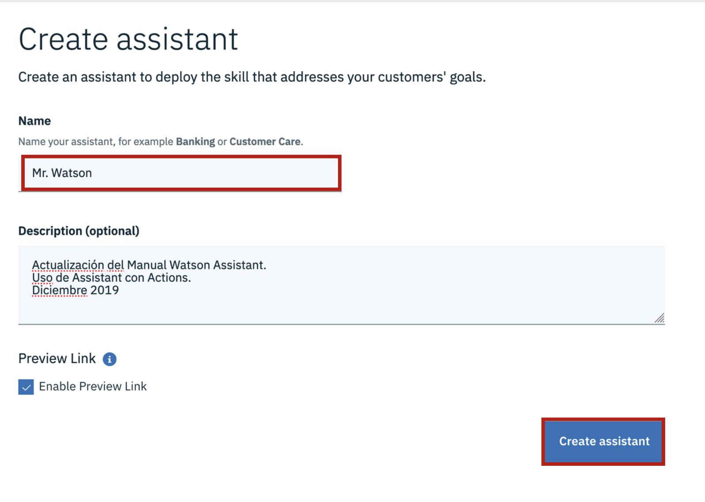  

3. Seleccionamos la pestaña “Create skill”, le damos un nombre a nuestro “Skill”, seleccionamos el idioma “Spanish” y damos clic en “Create dialog skill”.

  

4. Ahora vamos a seleccionar el apartado “Entities” y nos mantenemos en el sub- apartado “My entities” y damos clic en “Create entities”.

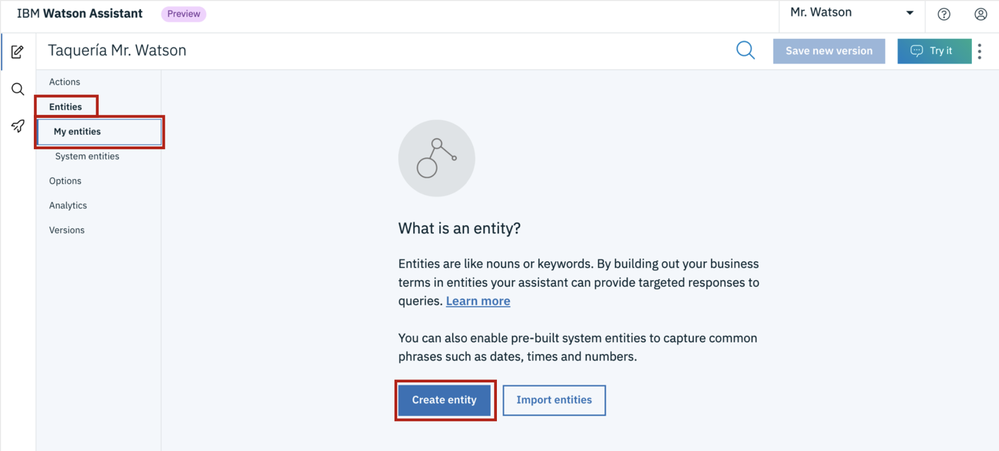  

5. Le damos el nombre de “Tipo-de-taco” y damos clic en “Create entity”. Nota: no acepta espacios ni caracteres especiales en el nombre.

  

6. Asignamos el valor “pastor” con los sinónimos que sean necesarios y damos clic en “Add value”.

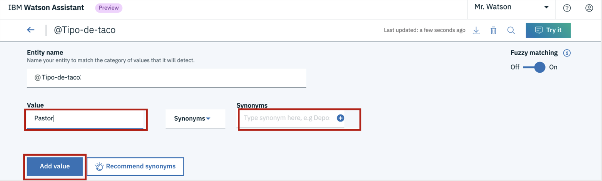  

7. Agregamos los demás valores de la misma forma en que agregamos el primer valor y damos clic en la flecha para regresar a nuestras entidades.

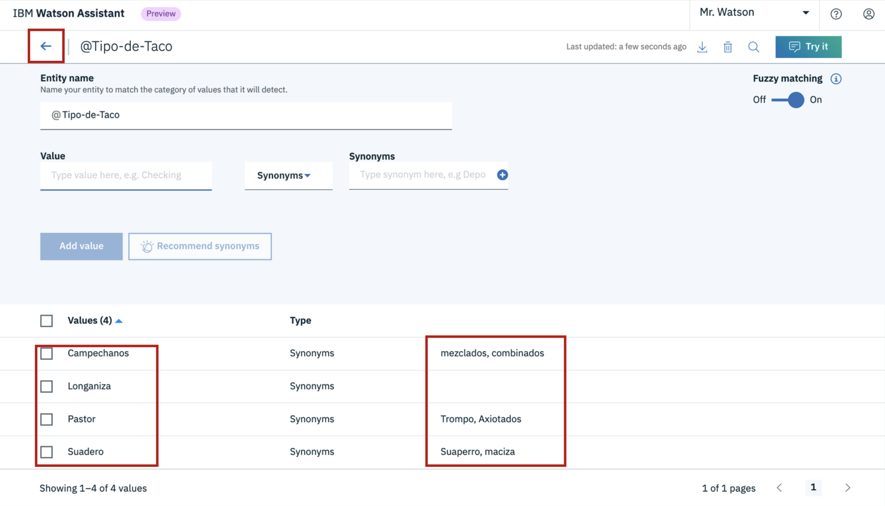  

8. Una vez de regreso en “My entities”, damos clic al apartado inmediatamente inferior “System entities” y activamos “@sys-number”.

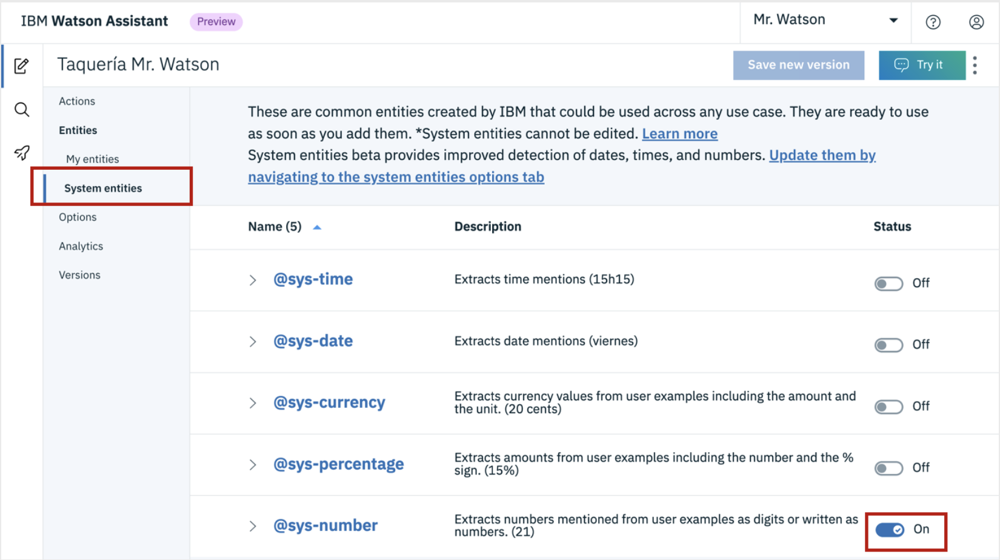  

9. Pasamos al apartado “Actions” y damos clic en “New Action”.

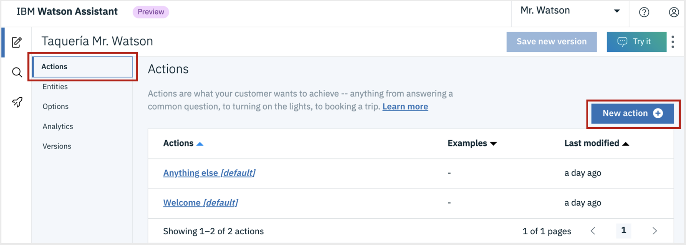  

10. Le damos un nombre a nuestra primera acción “Saludo” y en “Customer says” escribimos al menos 10 ejemplos diferentes de saludos del usuario.

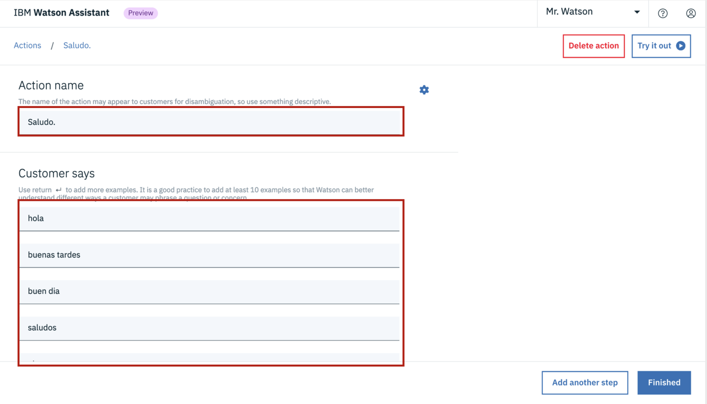  
<i><b>Recuerda que el usuario puede escribir con faltas ortográficas.<i/><b/>

11. En “Assistant responds”, vamos a dar las posibles respuestas que dará nuestro asistente, dando un salto de línea al terminar cada ejemplo (recuerda que esto es lo que verá el usuario, así que trata de mantener un formato que corresponda al tipo de usuario que interactuará con el asistente, a demás de una buena ortografía). Una vez hecho esto, damos clic en “random” para que nuestro asistente mande las diferentes respuestas de forma aleatoria.

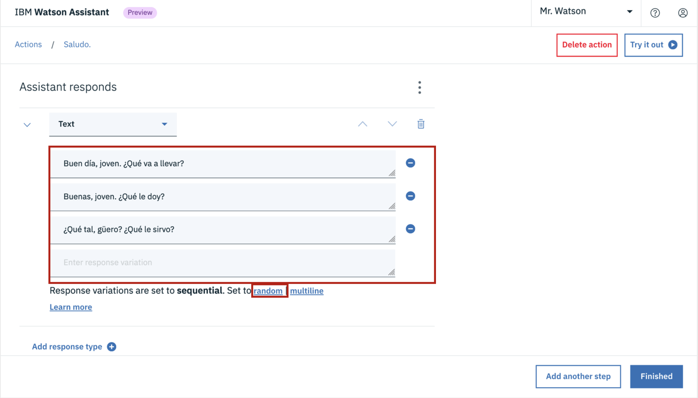  

12. En “Then assistant should”, dejamos el valor “Wait for reply” y damos clic en el botón “Finished”.

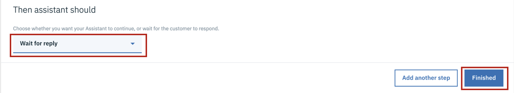  

13. De la misma forma, creamos la acción “Menú”.

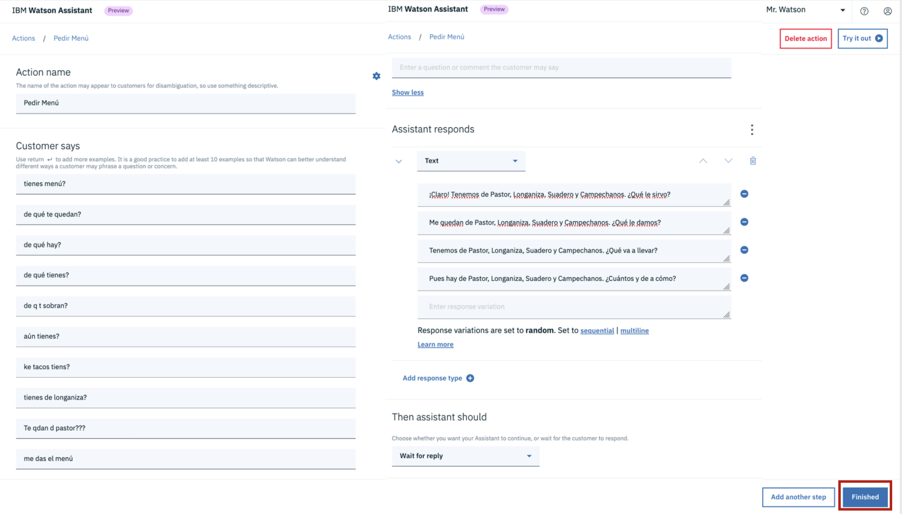  

14. Damos click al nodo creado y le ponemos el nombre de “Ubicación”, le damos diez ejemplos de entradas de usuarios y en “Assistant responds”, seleccionamos los tres puntos de la derecha (menú de hamburguesa) y seleccionamos la opción “Open context editor”

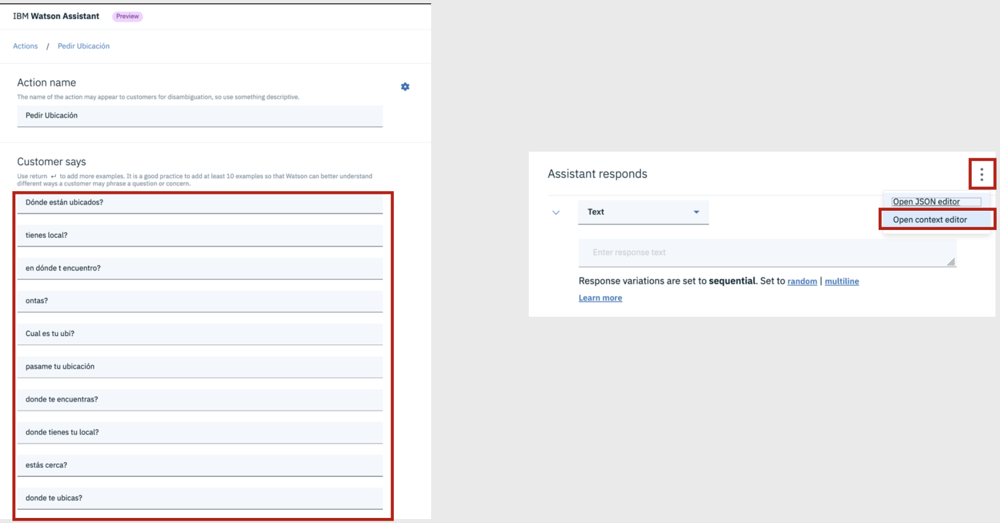  

15. En variable escribimos “BANDERA_UBICACIÓN” (El “$” está por default.) y en valor escribimos “TRUE”. En donde dice “Assistant responds” escribimos un part de variaciones de respuesta, y en el apartedo “Then assistant should”, mantenemos el valor “Wait for reply” y damos clic en “Finished”

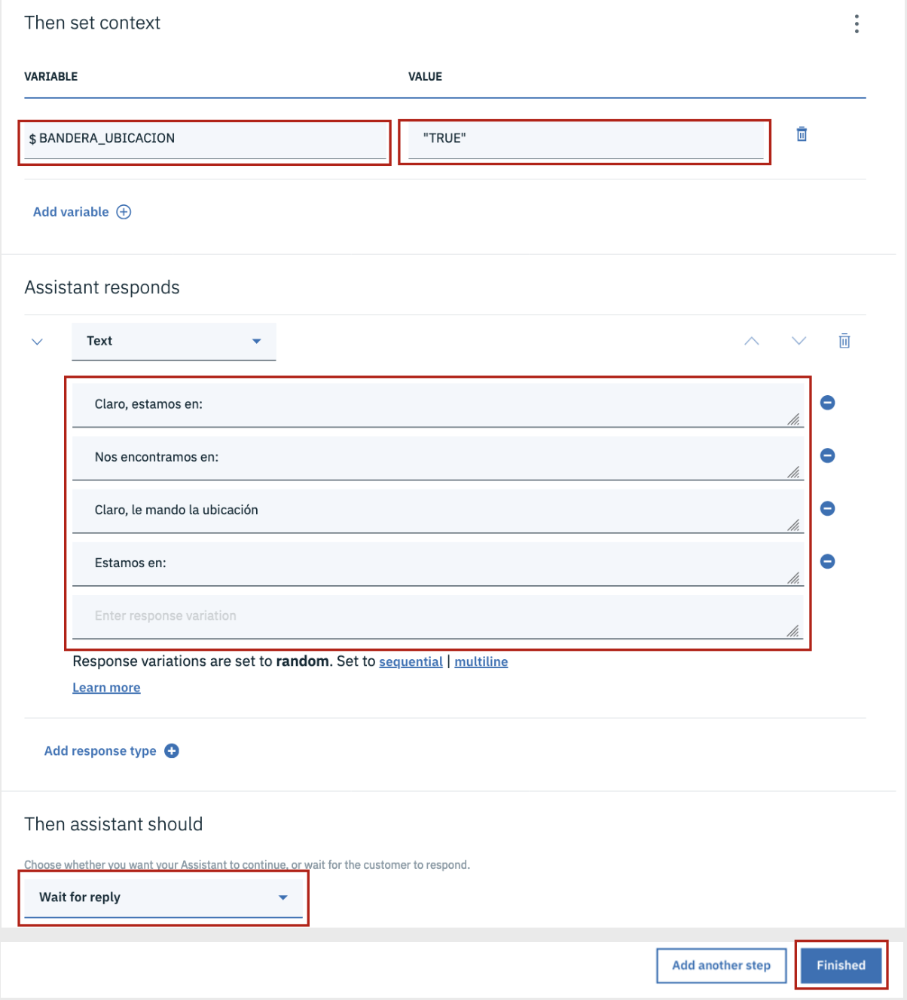  

16. Una vez de vuelta en las acciones de nuestro skill de diálogo, damos clic en la nave espacial del menú desplegable del lado izquierdo (“Go live”)

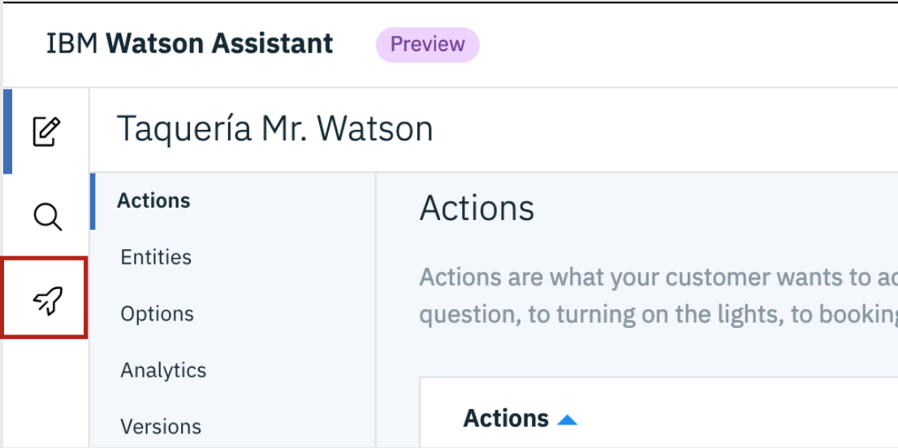  

17. Una vez que visualicemos los skills de diálogo que tenemos, damos clic en los tres puntos que se encuentran en la esquina superior derecha de nuestro skill (menú de hamburguesa) y damos clic en “View API Details”

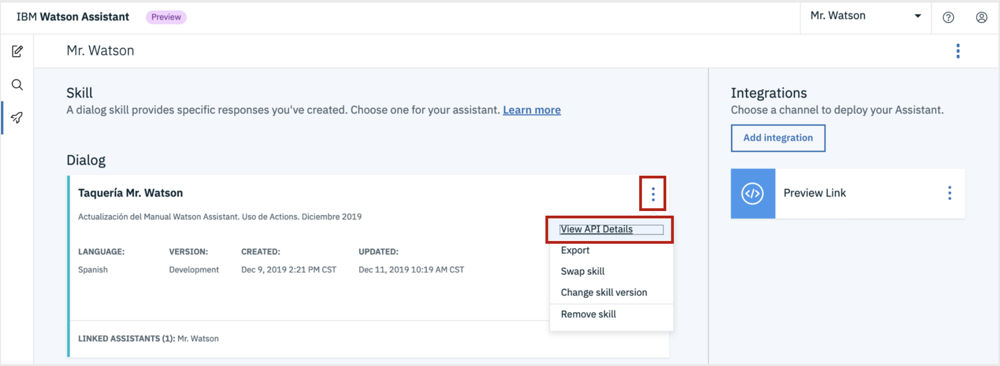  

18. A continuación, podremos visualizar las credenciales del servicio.

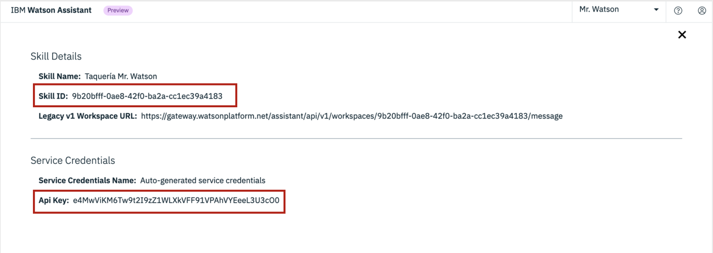  

# Probando la app en Node JS
1. Descargamos este repositorio a la computadora.

  

2. Una vez hecho esto, accedemos a la carpeta en donde esté nuestro repositorio y abrimos el archivo “app.js” en un editor de texto.

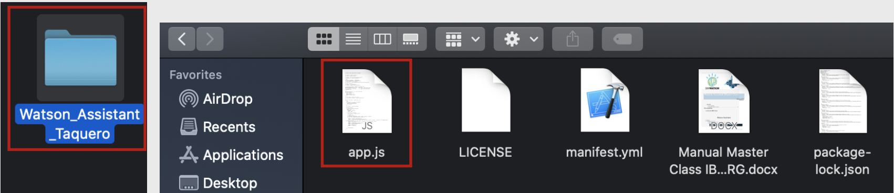  

3. Cambiamos los valores de “wconv_workspaceId” por el ID de tu “Skill” y “wconv_apikey” por la apikey de tu instancia.

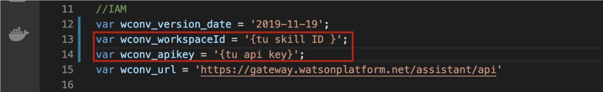  

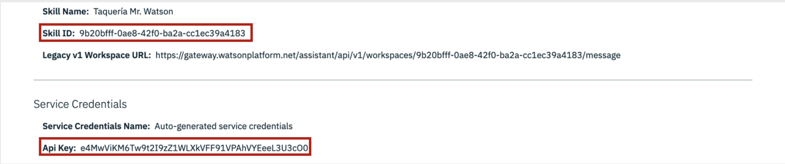  

4. Hecho esto, accedemos a la carpeta del repositorio desde la Terminal, cmd o PowerShell e ingresamos los siguientes comandos:
###
    npm install
    npm start
5. Una vez que nos aparezca la dirección local en la que se desplegó nuestra app, accedemos a ella desde el navegador y la probamos.

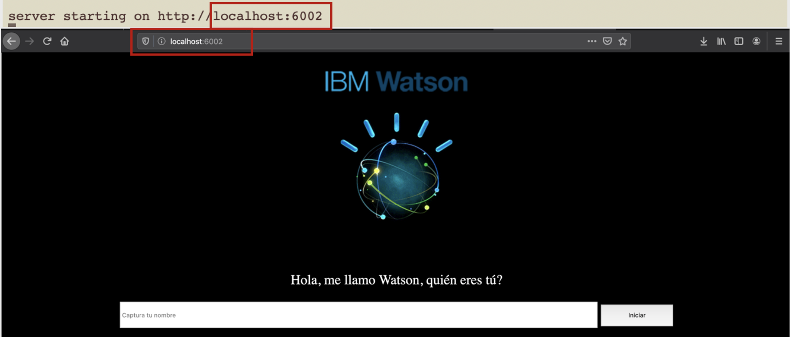  
